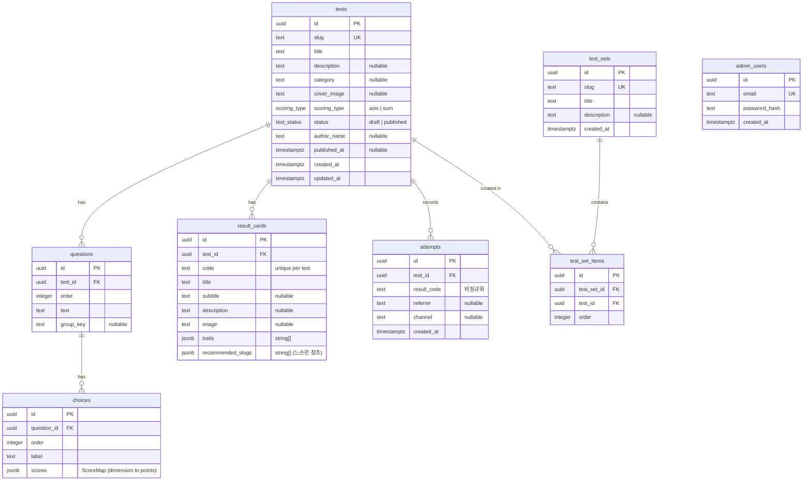

# donutest — ERD

> `src/server/db/schema.ts`(Drizzle)와 1:1로 대응합니다. 스키마를 바꾸면 이 다이어그램도 함께 갱신하세요.
> Mermaid로 작성되어 GitHub·VS Code(Mermaid 확장) 등에서 바로 렌더링됩니다.

## 노트

**Enums**
- `scoring_type`: `axis`(축별 승자 조합) · `sum`(최고점 유형)
- `test_status`: `draft` · `published`

**복합 제약**
- `result_cards`: `UNIQUE(test_id, code)` — 결과 코드는 테스트 내에서 유일
- `test_set_items`: `UNIQUE(test_set_id, test_id)` — 한 세트에 같은 테스트 중복 방지

**인덱스**
- `tests(status, published_at)` — 최신/공개 목록
- `questions(test_id)`, `choices(question_id)`, `result_cards(test_id)`, `test_set_items(test_set_id)`
- `attempts(test_id, created_at)` + `attempts(created_at)` — "최근 7일 인기" 및 기간별 집계

**참조 정책**
- 모든 FK는 `ON DELETE CASCADE`. 테스트를 지우면 문항·선택지·결과카드·세트항목·응시기록이 함께 삭제됩니다.
- `attempts.result_code`는 결과카드로의 FK가 아닌 **문자열 비정규화** — 결과카드가 바뀌거나 삭제돼도 과거 응시 기록은 그대로 보존됩니다.
- `result_cards.recommended_slugs`는 **느슨한 참조**(jsonb) — 외부/미발행 테스트도 가리킬 수 있어 FK를 걸지 않습니다.

**독립 테이블**
- `admin_users` — `/admin` 접근 전용. 공개 사용자는 인증이 없습니다.
